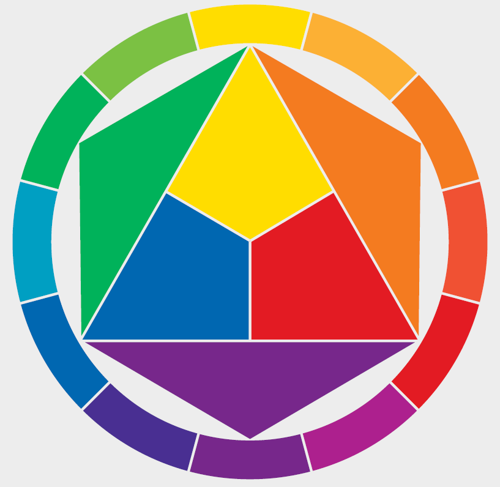

**Colour theory** is the guidelines that people use when choosing colours and how they can be used together to make nice looking visuals. By understanding color theory basics, you can evoke a particular emotion, vibe, or aesthetic simply by using different colours together. A **Colour palette** is a collection of colours which work together to evoke a certain feeling or emotion from the viewer.

### Basic colour theory 
There are three types of colours: primary, secondary, and tertiary colours.

**Primary colours** are the building blocks of all colour. They have only a single colour in their mix, and cannot be created by mixing any other colours - the primary colours are red, yellow and blue. 

There are three **Secondary colours**, which are made up of a mix of two of primary colours: 
+ green is a combination of yellow and blue
+ orange is a combination of red and yellow 
+ purple is a combination of red and blue

**Tertiary colours** are any combination of a primary colour and a secondary colour (or more!).

Below is a palette tool called Coolors. By clicking the **Generate** button below, you will be able to build a palette of complementary colours. 

If you see a colour you like, click on the eye icon at the bottom to find the RGB values:

<iframe width="600px" height="600px" src="https://coolors.co/generate" title="Coolors palette generator" frameborder="0"></iframe>>

